# Práctica 2: Aplicación móvil básica para operaciones CRUD con un servicio REST

**Instituto Politécnico Nacional**  
**Escuela Superior de Cómputo (ESCOM)**  

* **Alumno:** Miguel Ángel Cruz Villa
* **Boleta:** 2024630153
* **Grupo:** 7CV4
* **Asignatura:** Desarrollo de aplicaciones móviles nativas
* **Profesor:** Gabriel Hurtado Avilés
* **Fecha de Entrega:** Viernes 18 de septiembre de 2026

---

## Introducción
El presente proyecto consiste en el desarrollo de una aplicación móvil nativa en Android capaz de realizar operaciones CRUD (Crear, Leer, Actualizar, Borrar) consumiendo un servicio REST dockerizado. El sistema incluye un esquema de autenticación que permite el registro e inicio de sesión de usuarios, asegurando la protección de las contraseñas mediante encriptación.

**Punto de partida y modificaciones:**
Para esta práctica se tomó como base el repositorio de ejemplo proporcionado: `https://github.com/gabrielhuav/Flask-Compose-Login-API`. Sobre esta base, se realizaron las siguientes aportaciones propias:
* **Backend:** Se agregó el modelo `Task` en `app.py` utilizando Flask-SQLAlchemy para persistencia en SQLite. Se programaron los endpoints POST, GET, PUT y DELETE para gestionar las tareas.
* **Frontend:** En el proyecto Android (`Android/FlaskLogin`), se completó la lógica de conexión integrando la librería Retrofit dentro de un nuevo paquete `network`. Se diseñó la interfaz de usuario utilizando Jetpack Compose, creando las pantallas `AuthScreen` y `TaskScreen` para manejar la navegación, los estados de sesión y la visualización de las tareas.

**Justificación del Stack Tecnológico:**
* **Flask y SQLite:** Se eligieron por ser minimalistas y no requerir configuraciones de bases de datos externas, permitiendo que el contenedor arranque en segundos.
* **Flask-Bcrypt:** Utilizado para el hasheo seguro de contraseñas, cumpliendo con el requisito de no almacenar credenciales en texto plano.
* **Jetpack Compose y Retrofit:** Proporcionan un marco moderno, declarativo y eficiente para construir interfaces responsivas nativas en Android y manejar peticiones HTTP asíncronas mediante corrutinas.

---

## Desarrollo

### Conceptos Fundamentales
* **Docker:** Plataforma que empaqueta una aplicación junto con su runtime, librerías y configuración en una unidad aislada llamada contenedor. Comparte el núcleo del sistema operativo anfitrión, permitiendo reproducibilidad en cualquier equipo.
* **Imagen y contenedor:** La imagen es la plantilla inmutable, mientras que el contenedor es la instancia en ejecución de esa imagen. Al ser efímero, la información persistente debe guardarse en volúmenes.
* **Dockerfile:** Archivo de texto con instrucciones paso a paso (FROM, WORKDIR, COPY) que Docker ejecuta para construir la imagen del backend.
* **docker-compose.yml:** Archivo YAML que describe la aplicación como un conjunto de servicios, permitiendo levantar todo el entorno con un solo comando.
* **Backend REST:** Programa en el servidor que expone la lógica de negocio mediante rutas HTTP (GET, POST, PUT, DELETE), respondiendo en formato JSON con códigos de estado correspondientes.
* **ORM y base de datos:** El Object-Relational Mapping (SQLAlchemy) permite manipular tablas como objetos de Python sin escribir SQL directo. En este caso, SQLite almacena todo en un archivo local.

### Documentación de Endpoints

| Método | Ruta | Descripción | Parámetros (Body/Path) | Respuesta Exitosa (JSON) |
|---|---|---|---|---|
| **POST** | `/register` | Registra un nuevo usuario | `{"username": "x", "password": "y"}` | `201 Created`: `{"message": "Usuario creado exitosamente"}` |
| **POST** | `/login` | Valida credenciales e inicia sesión | `{"username": "x", "password": "y"}` | `200 OK`: `{"status": "success", "user_id": 1}` |
| **POST** | `/tasks` | Crea una nueva tarea | `{"title": "x", "description": "y", "user_id": 1}` | `201 Created`: `{"message": "Tarea creada"}` |
| **GET** | `/tasks/<user_id>` | Obtiene las tareas de un usuario | Path: `user_id` (int) | `200 OK`: `[{"id": 1, "title": "...", "description": "..."}]` |
| **PUT** | `/tasks/<task_id>` | Actualiza una tarea existente | Path: `task_id` (int), Body: `{"title": "x"}`| `200 OK`: `{"message": "Tarea actualizada"}` |
| **DELETE**| `/tasks/<task_id>` | Elimina una tarea | Path: `task_id` (int) | `200 OK`: `{"message": "Tarea eliminada exitosamente"}` |

### Instrucciones de Instalación y Ejecución

**1. Levantar el Backend (Docker)**
1. Clonar este repositorio y navegar a la carpeta `Docker-Flask/ORM`.
2. Ejecutar el comando para construir y levantar el servicio:

       docker compose up --build

3. El servidor estará escuchando en el puerto 5000.

**2. Ejecutar la Aplicación Android**
1. Abrir la carpeta `Android/FlaskLogin` en Android Studio.
2. Configurar la URL base en `network/ApiClient.kt`:
   * **Para Emulador:** Utilizar `http://10.0.2.2:5000/` ya que el emulador tiene su propia red virtual.
   * **Para Dispositivo Físico (Wi-Fi):** Cambiar a la IP local de la computadora (ej. `http://192.168.1.XX:5000/`). Fue necesario desactivar temporalmente el Firewall de Windows Defender para permitir el tráfico HTTP entrante al puerto 5000 a través de la red local.
3. Compilar y ejecutar en el dispositivo. (Se configuró `android:usesCleartextTraffic="true"` y el permiso de `INTERNET` en el `AndroidManifest.xml` para permitir el consumo local sin HTTPS).

---

### Evidencias de la modificación del código
* *Código ApiClient:*
  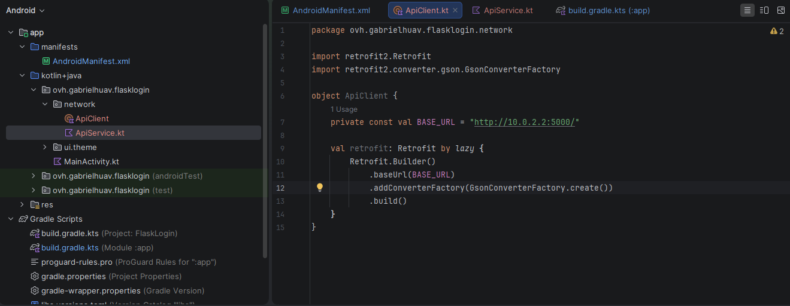
* *Código ApiService:*  
  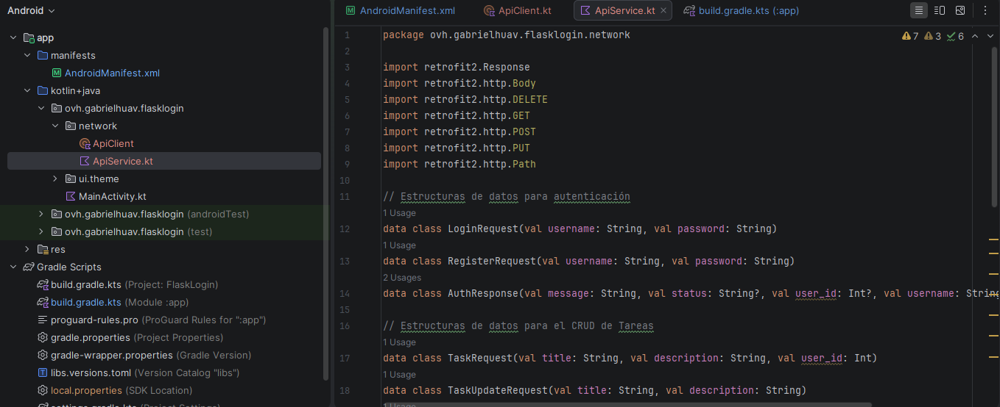
* *Código modificado del app.py*  
  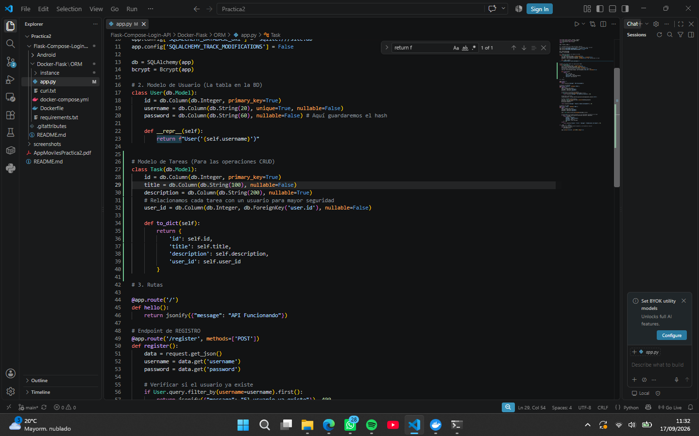
* *Código de las operaciones CRUD*  
  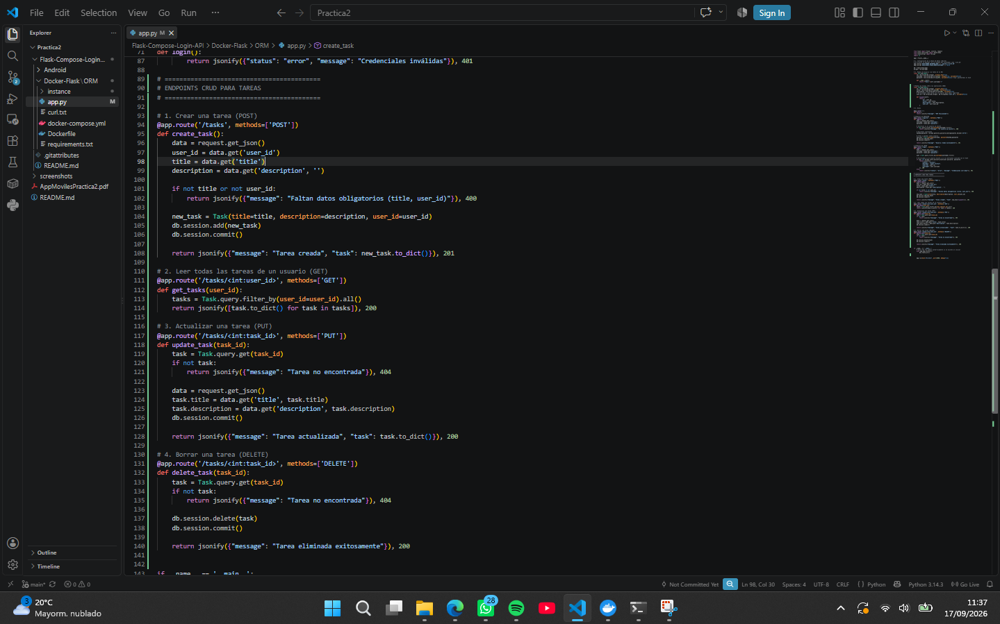

---

### Evidencias de Ejecución

**Fase 1: Backend en Terminal (cURL)**
* *Docker levantado:*
  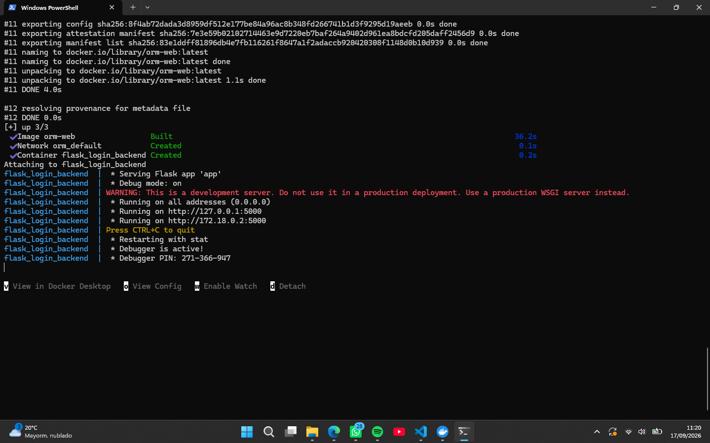
* *Prueba de Registro de Usuario:*  
  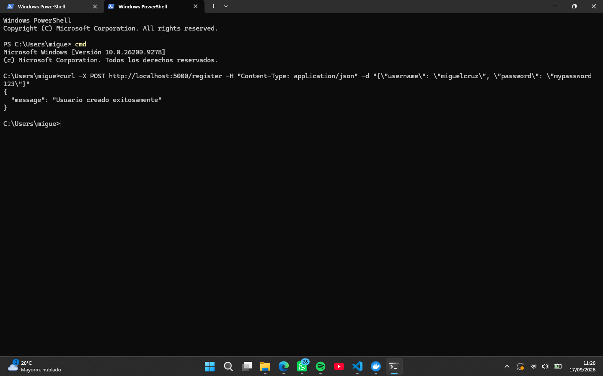
* *Operación POST (Crear Tarea):*  
  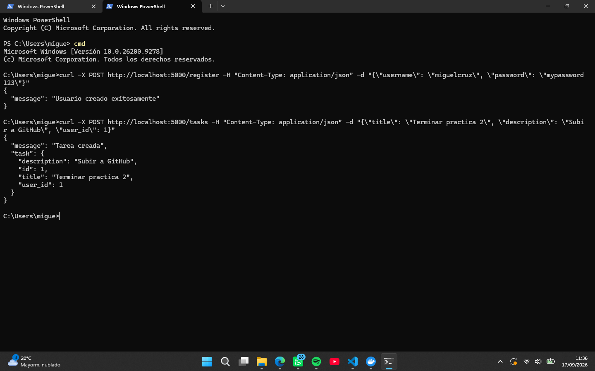
* *Operación GET (Leer Tareas):*  
  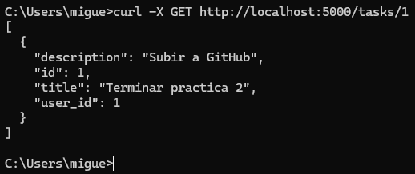
* *Operación PUT (Actualizar Tarea):*  
  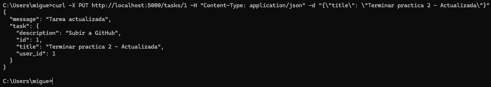
* *Operación DELETE (Borrar Tarea):*  
  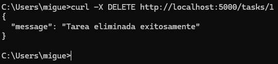

**Fase 2: Aplicación Móvil (Dispositivo Físico)**
* *Manejo de Errores (Credenciales incorrectas):*  
  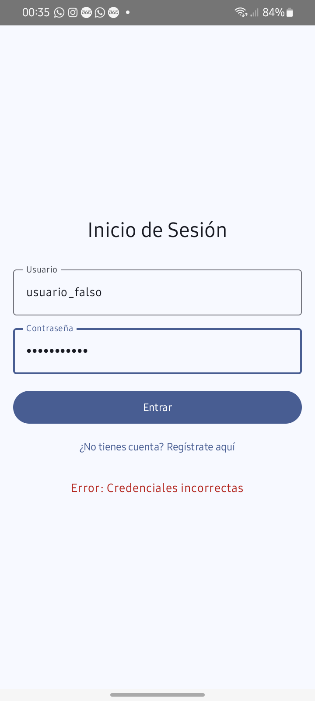
* *Registro de Usuario Exitoso:*  
  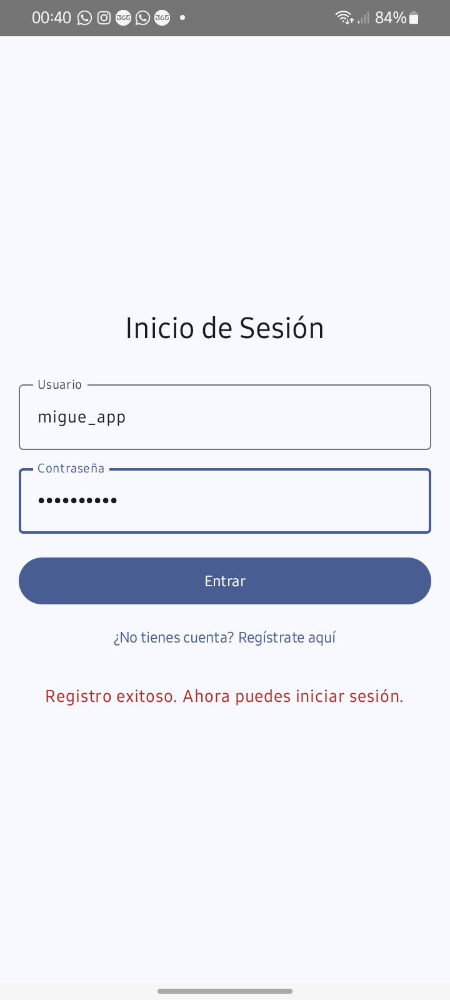
* *Login Exitoso e Ingreso:*  
  
* *Operaciones POST y GET (Lista de Tareas):*  
  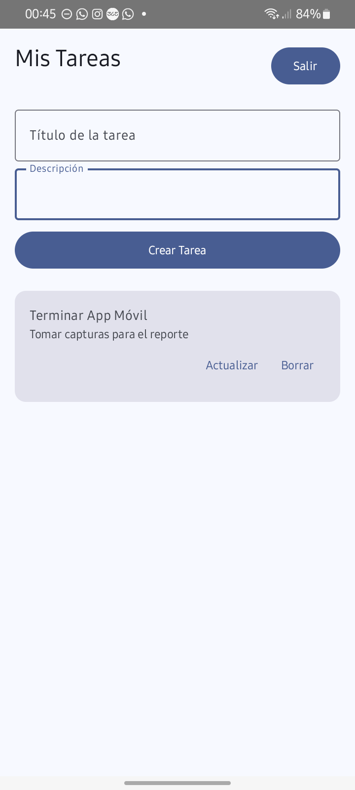
* *Operación PUT (Tarea Actualizada):*  
  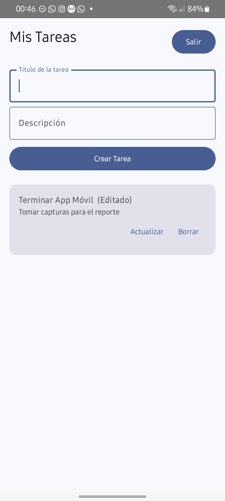
* *Operación DELETE (Lista vacía tras borrado):*  
  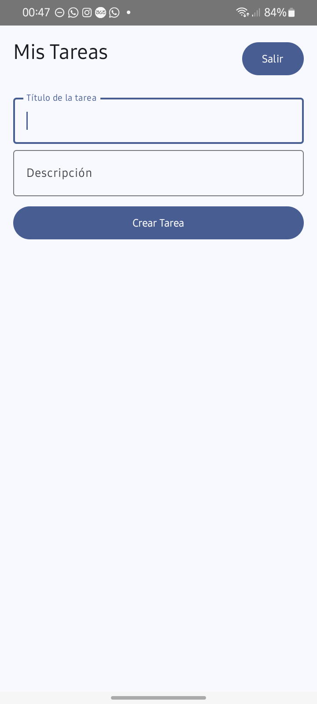

---

## Conclusiones
El desarrollo de esta práctica permitió comprender la importancia de separar las responsabilidades entre el cliente (aplicación móvil) y el servidor (API REST). Entre los principales retos destacó el manejo de la estructura de paquetes en Android Studio para respetar la arquitectura de la aplicación, así como la correcta configuración de la red local para lograr que un dispositivo físico pudiera comunicarse con el contenedor de Docker puenteando las reglas de firewall del sistema operativo. Se logró consolidar el uso de Jetpack Compose para crear interfaces dinámicas basadas en estados, y el uso de Retrofit para estructurar peticiones HTTP asíncronas sin bloquear el hilo principal de la aplicación. 

## Bibliografía
* Docker Inc. (2026). *Docker Documentation: Docker Compose*. Recuperado de https://docs.docker.com/compose/
* Google Developers. (2026). *Jetpack Compose Tutorial*. Android Developers. Recuperado de https://developer.android.com/jetpack/compose/tutorial
* Pallets Projects. (2026). *Flask Documentation (3.0.x)*. Recuperado de https://flask.palletsprojects.com/
* Square, Inc. (2026). *Retrofit: A type-safe HTTP client for Android and Java*. Recuperado de https://square.github.io/retrofit/
