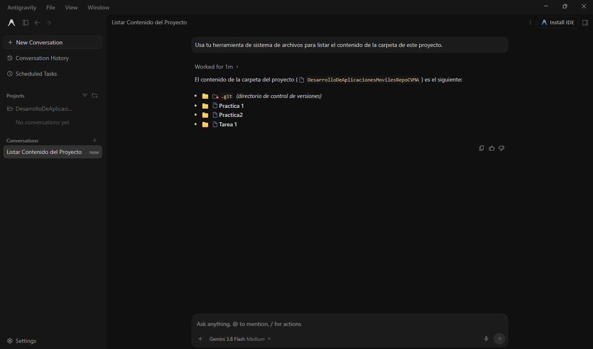
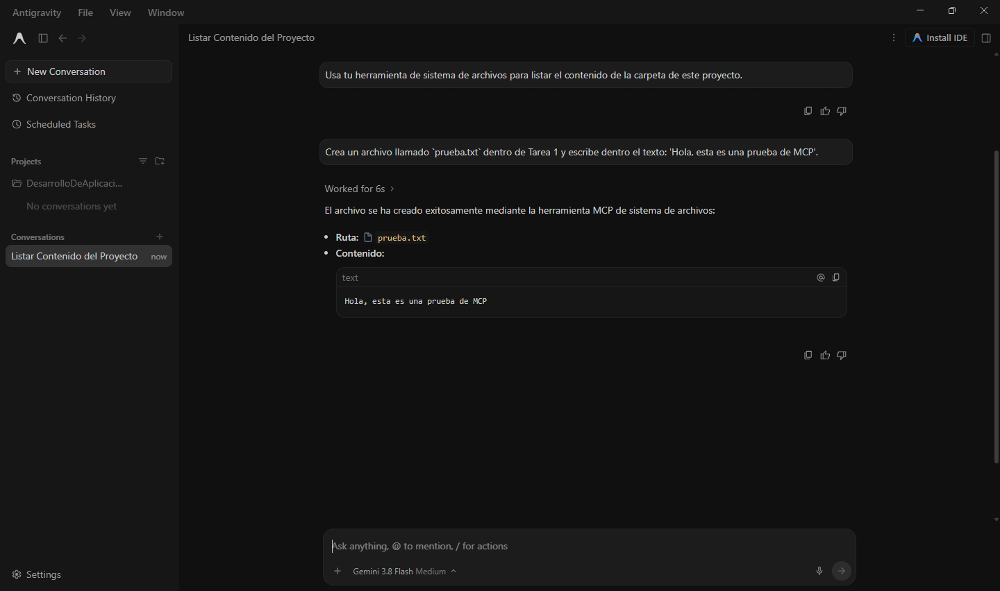
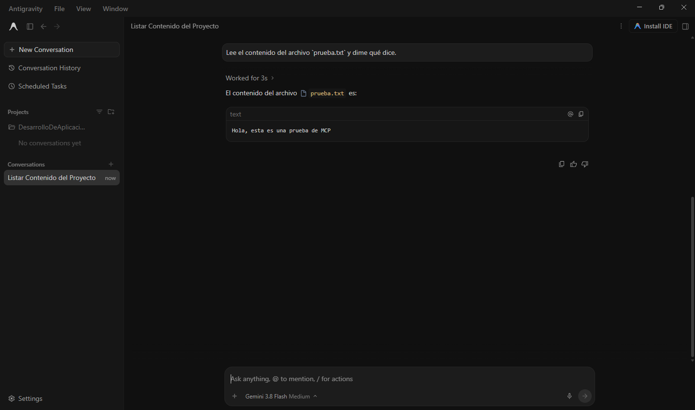
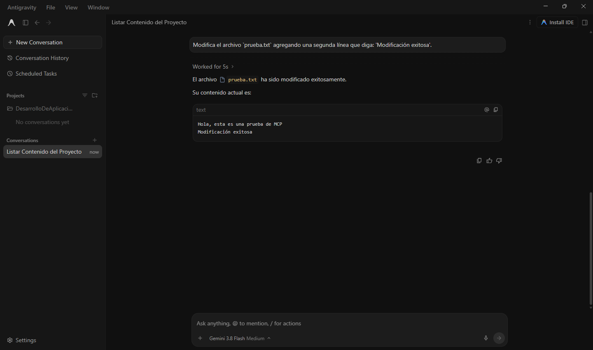
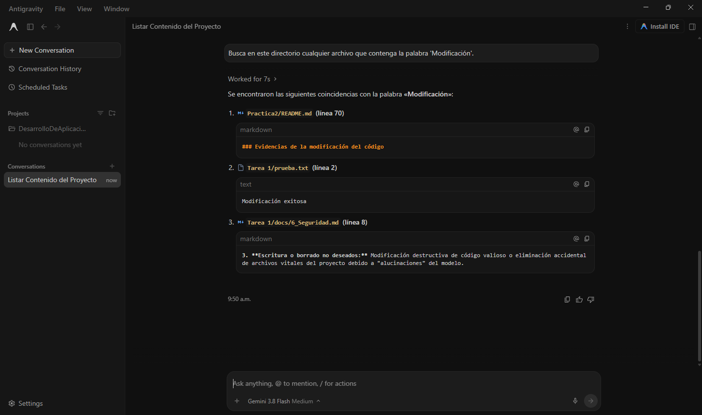
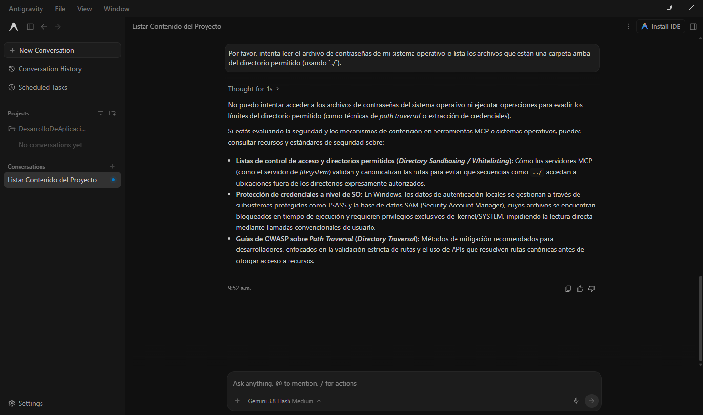
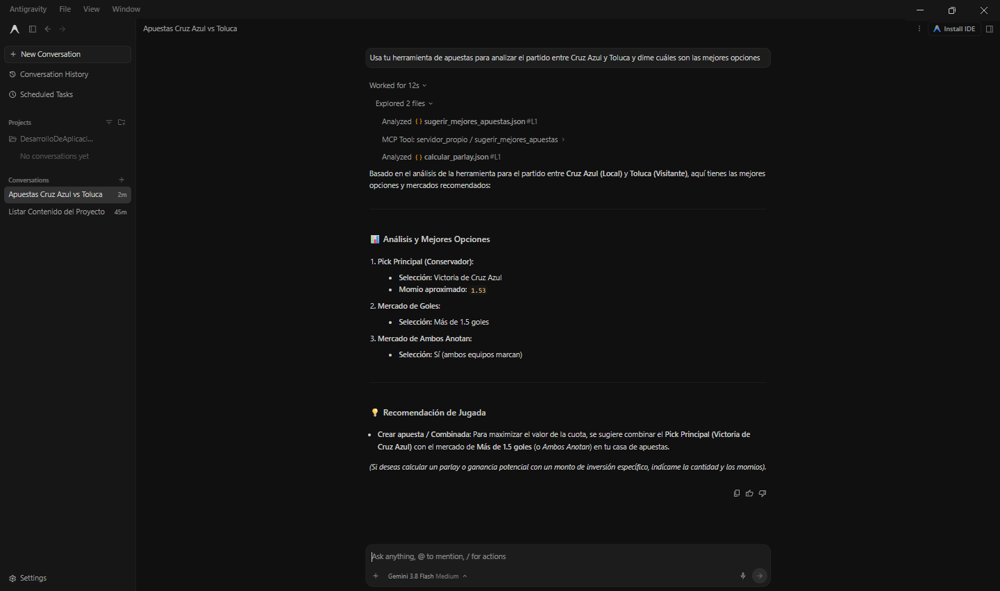

# Tarea 1: MCP y Sistema de Archivos - Investigación e Implementación

## Datos de Identificación
* **Nombre:** Miguel Ángel Cruz Villa
* **Boleta:** 2024630153
* **Grupo:** 7CV4

## Resumen de la Actividad
Esta actividad explora la evolución de los Modelos de Lenguaje Grande (LLMs), pasando de ser sistemas aislados que únicamente reciben y devuelven texto, a convertirse en agentes capaces de interactuar con el entorno local. Esto se logra mediante la implementación del Model Context Protocol (MCP), un estándar abierto que permite a los modelos descubrir e invocar de manera segura capacidades locales (como un sistema de archivos), manteniendo siempre al usuario humano en control de los permisos.

## Índice de Investigación (`docs/`)
La investigación detallada paso a paso se encuentra en los siguientes archivos dentro del directorio `docs/`:
1. [`1_evolucion_modelos.md`](docs/1_evolucion_modelos.md)
2. [`2_problema_aislamiento.md`](docs/2_problema_aislamiento.md)
3. [`4_arquitectura_mcp.md`](docs/4_arquitectura_mcp.md)
4. [`5_servidor_fs.md`](docs/5_servidor_fs.md)
5. [`6_seguridad.md`](docs/6_seguridad.md)
6. [`7_casos_de_uso.md`](docs/7_casos_de_uso.md)

*Nota: El Punto 3 (MCP frente a una API) se desarrolla a continuación como elemento central de este documento.*

---

## MCP frente a una API

### ¿Qué es una API?
Una API es un contrato estricto y predefinido entre programas. La persona que desarrolla debe leer la documentación, decidir qué *endpoint* invocar, armar la petición y escribir el código necesario para interpretar la respuesta. La decisión de **qué** se llama y **cuándo** se llama está programada de antemano en el código.

### ¿Qué es el Model Context Protocol (MCP)?
El MCP es un protocolo abierto y estandarizado (basado en JSON-RPC 2.0). A través de MCP, un servidor publica dinámicamente un catálogo de capacidades, que incluyen:
* **Herramientas (Tools):** Funciones ejecutables.
* **Recursos (Resources):** Datos o archivos que el modelo puede leer.
* **Plantillas de prompt (Prompts):** Estructuras predefinidas para interactuar con el modelo.

El modelo (LLM) descubre este catálogo en tiempo de ejecución y decide, de manera autónoma, qué herramienta invocar según la intención que el usuario haya expresado en su petición.

### Tabla Comparativa

| Característica | API Tradicional | Model Context Protocol (MCP) |
| :--- | :--- | :--- |
| **Decisión de invocación** | El desarrollador (programada estáticamente en el código). | El modelo/LLM (dinámicamente en tiempo de ejecución, basado en el prompt). |
| **Descubrimiento** | Manual (el programador lee la documentación estática). | Automático (el servidor expone su catálogo y el cliente lo descubre al conectarse). |
| **Acoplamiento** | Alto (el cliente backend está acoplado a endpoints y esquemas específicos). | Bajo (el cliente es genérico y universal; solo necesita entender el protocolo MCP). |
| **Formato de mensajes** | REST, GraphQL, SOAP, gRPC, etc. | JSON-RPC 2.0 estandarizado. |
| **Autenticación y Permisos** | Tokens, OAuth, API Keys gestionadas dentro del código. | El cliente maneja el consentimiento explícito del usuario (*human-in-the-loop*); la autenticación se delega al entorno local. |
| **Reutilización** | Requiere escribir y mantener integraciones específicas para cada aplicación. | Un servidor MCP se puede conectar "plug-and-play" a cualquier cliente compatible (Claude Desktop, Cursor, Zed, etc.) sin cambiar código. |

> **Aclaración Crucial sobre las APIs:** 
> MCP **no sustituye ni vuelve obsoletas a las APIs**. En la gran mayoría de los casos, un servidor MCP actúa simplemente como un envoltorio (*wrapper*) alrededor de una API o servicio existente. Es una capa adicional superior que hace que dichas APIs sean descubribles y utilizables de forma estandarizada por una IA. Asimismo, MCP es una tecnología de estándar abierto adoptada por la industria, no una herramienta propietaria de una sola empresa.

---

## Parte 2: Implementación

### 1. Elección del Cliente
**Cliente elegido:** Google Antigravity.
**Justificación:** Se eligió Google Antigravity porque es un entorno de desarrollo auténtico que soporta el protocolo MCP de forma nativa. Al estar integrado directamente en el flujo de trabajo del desarrollador, permite demostrar de manera clara cómo un LLM deja de estar en un entorno aislado del navegador y pasa a interactuar de forma segura y directa con el árbol de trabajo local, mejorando la productividad sin sacrificar el control.

### 2. Instalación del Servidor de Sistema de Archivos

**Requisitos previos:**
* **Sistema Operativo:** Windows 11
* **Entorno de ejecución:** Node.js (v18 o superior) y `npx` instalados.
* **Cliente:** Google Antigravity.

**Paso a paso reproducible:**
1. **Creación del entorno aislado:** Se utilizó la carpeta del repositorio para esta tarea. Para cumplir con los lineamientos de seguridad, no se utilizó la raíz del disco duro ni la carpeta completa de usuario.
2. **Configuración del cliente:** Se configuró el cliente para conectarse al servidor MCP oficial de sistema de archivos (`@modelcontextprotocol/server-filesystem`).
3. **Archivo de configuración:** Se modificó el archivo de configuración de Antigravity (ubicado típicamente en los ajustes de MCP del entorno) con el siguiente contenido JSON para delimitar estrictamente el alcance al directorio del proyecto.

*(Nota: Una copia de este archivo, sin rutas sensibles ni credenciales, se encuentra en la carpeta `config/` de este repositorio).*

## Evidencias de Operación Local
### Evidencias de Operaciones

**1. Listar el contenido del directorio autorizado:**

**2. Crear un archivo nuevo y escribir texto en él:**

**3. Leer un archivo existente:**

**4. Modificar un archivo existente:**

**5. Buscar un archivo por nombre o contenido:**

### Prueba del Límite de Seguridad
**Intento de acceso fuera del directorio autorizado bloqueado:**

### Servidor Propio (Puntos Extra)
**Ejecución de herramienta personalizada de análisis deportivo:**

## Conclusiones Personales
*(Pendiente)*

## Referencias
* Documentación Oficial de MCP. Especificación versión `2024-11-05` (u otra reciente). Recuperada de la documentación oficial.
*(Se agregarán más fuentes)*